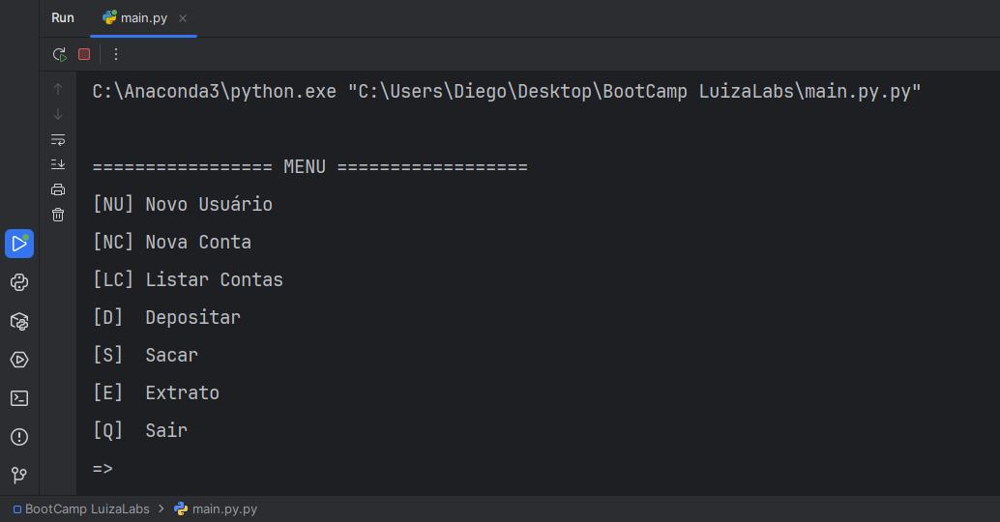
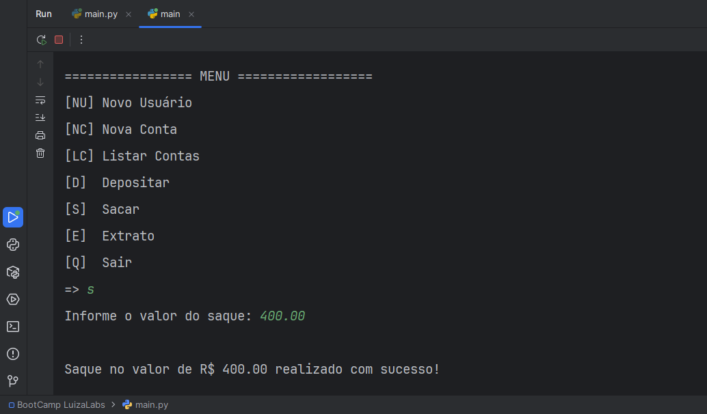
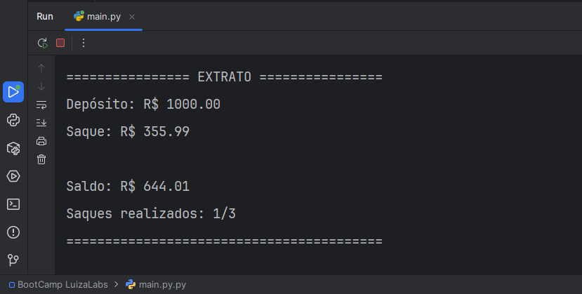

# 💰 Sistema Bancário em Python  
Projeto desenvolvido durante o bootcamp **Luizalabs – Back-end com Python (DIO)**.  
Este sistema bancário simula operações básicas como criação de usuários, contas, depósitos, saques e emissão de extrato, utilizando apenas funcionalidades fundamentais da linguagem Python.

---

## 📌 Funcionalidades do Sistema

- Criar usuário
- Criar conta bancária
- Listar contas
- Depositar valores
- Sacar valores (com:
  - limite diário de 3 saques  
  - limite de R$ 500 por saque
)
- Gerar extrato com histórico de operações

---

## 🖥 Demonstração

### 📌 Menu Principal


### 📌 Realizando um Saque


### 📌 Extrato Bancário


---

## ▶ Como Executar

Certifique-se de ter Python instalado.  
Execute o arquivo principal:

```bash
python main.py
